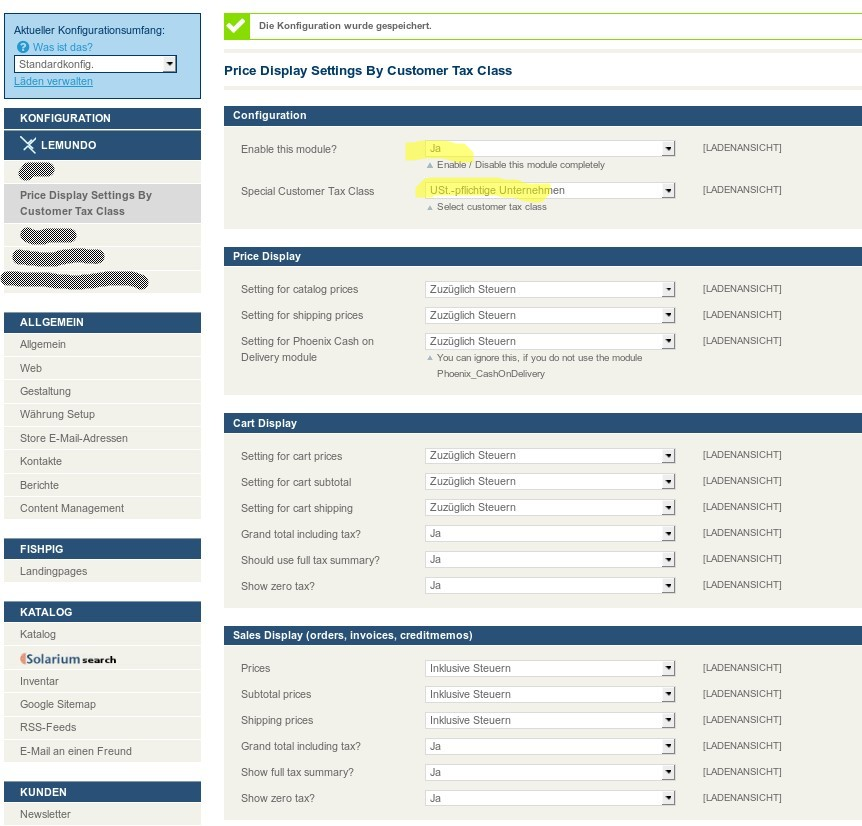

## Module Documentation

This module enables to set different price view settings for a specific customer tax class.
This is for example used to show prices including tax to all customers, BUT to show only prices without tax to certain customer groups which have a special customer tax class.
For example this is very useful for B2B shops.

Let's say you want to show prices including tax in your store, but you have some B2B customers which are used to shop
for prices without tax.
Using this extension, you can configure your store to do exactly this.

### What works and what does not

So far, I have only tested the functionality in the shop frontend.
I do not expect this to work in the backend with invoices etc.
If you need / build this, I would be happy about a pull request :)

### Configuration

In the backend under System -> Configuration you will find a tab "Lemundo" with the section "Price Display Settings By Customer Tax Class".
Activate the module there and select the customer tax class from the select box.
Then all the settings are just as the regular settings in the tax section, but they only apply for this customer tax class.

See this screenshot which illustrates the settings:

### Impact

Rewrites the Magento tax helper